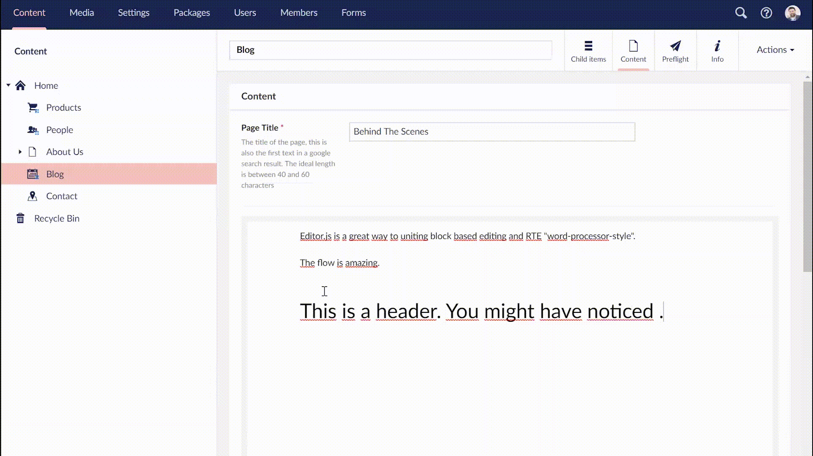

# Editor.js for Umbraco
**An Editor.js package for Umbraco 8**

# 👉 THIS IS A WORK IN PROGRESS

Based on [Editor.js](https://github.com/codex-team/editor.js). From [mindrevolution](https://www.mindrevolution.com) for [Umbraco](http://www.umbraco.org) with love. Maintained by [Marc Stöcker](https://twitter.com/esn303).

## Features
- Umbraco Property Editor
- Umbraco Grid Editor
- Image drag and drop upload while editing
- Clipboard pasting of images
- Integration with the Umbraco media library
- Multi-instance support on document types as well as in the grid

## Umbraco package installation
_(TODO)_

## Manual installation
These steps are required for manual installation:
- add `/App_Plugins/EditorJs/` to your website
- add `/bin/Our.Umbraco.EditorJs.dll` assembly

## Customize the editor
_(TODO)_

## Editor.js Documentation
Full documentation for Editor.js can be found [here](https://editorjs.io/base-concepts).

## Licence

- Editor.js Package for Umbraco is released under the [MIT license](https://opensource.org/licenses/MIT).
- [Editor.js](https://editorjs.io/) is provided under the [Apache License (Version 2.0)](https://opensource.org/licenses/Apache-2.0).

## Contributing

This project is open for collaboration. **Fork. Push. Innovate.**
