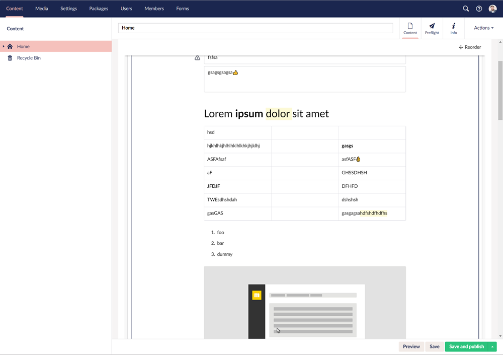

# Editor.js for Umbraco
**An Editor.js package for Umbraco 8**

Based on [Editor.js](https://github.com/codex-team/editor.js). From [mindrevolution](https://www.mindrevolution.com) for [Umbraco](http://www.umbraco.org) with love. Maintained by [Marc Stöcker](https://twitter.com/esn303).

## Quick start
This Umbraco package is for Umbraco 8

**Features**
- property editor
- grid editor
- allows image drag and drop upload to the page
- allows clipboard pasing of images
- integrates with the Umbraco media library
- multi instance support on doc types and in the grid

### Umbraco package installation
TODO

### Manual installation
These steps are required for manual installation:
- add [/App_Plugins/editorjs/] to your website
- add [/bin/Editorjs.dll] assembly

### Customize the editor
TODO

### Editor.js Documentation
Full documentation for Editor.js can be found [here](https://editorjs.io/base-concepts).

## Licence

Editor.js Package for Umbraco is released under the MIT license: [opensource.org/licenses/MIT](https://opensource.org/licenses/MIT)
[Editor.js](https://editorjs.io/) is provided under the Apache License (Version 2.0): [opensource.org/licenses/Apache-2.0](https://opensource.org/licenses/Apache-2.0)

## Contributing

This project is open for collaboration. **Fork. Push. Innovate.**